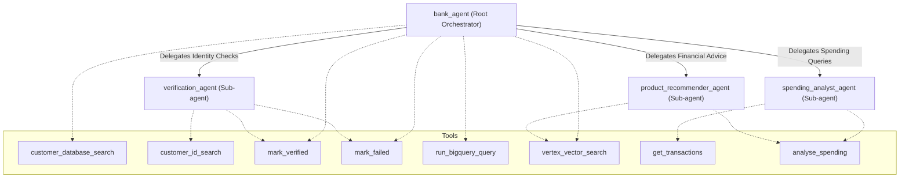

# Bank Agent Orchestrator

This directory contains the root `bank_agent` and its suite of specialist sub-agents. The `bank_agent` acts as the primary orchestrator, handling initial user interactions and delegating to specialist sub-agents based on the user's intent.

## Architecture & Component Diagram

The following diagram illustrates the relationship between the root agent, its sub-agents, and the tools they each have access to.

## Agents Overview

### 1. `bank_agent` (Root Agent)
- **Role**: The main conversational interface for the customer. It handles general banking queries, routes users through identity verification, and delegates specialized requests to the appropriate sub-agents.
- **Key Tools**: `customer_database_search`, `vertex_vector_search`, `run_bigquery_query`, `mark_verified`, `mark_failed`.

### 2. `verification_agent` (Sub-agent)
- **Role**: A strict, sandboxed agent responsible solely for verifying the customer's identity. It asks for verification details (like DOB or Postcode) and compares them against the database.
- **Key Tools**: `customer_id_search`, `mark_verified`, `mark_failed`.
- **Note**: Other sub-agents use a `before_agent_callback` to ensure they are only invoked *after* this agent has successfully verified the customer.

### 3. `spending_analyst_agent` (Sub-agent)
- **Role**: Analyzes the customer's spending habits. It categorizes transactions into budgets (Needs, Wants, Savings) and provides temporal breakdowns (weekly, monthly, annual). 
- **Key Tools**: `get_transactions`, `analyse_spending`.

### 4. `product_recommender_agent` (Sub-agent)
- **Role**: A proactive financial advisor agent. It uses the customer's spending data to identify overspending and cross-references it with live bank products to suggest concrete reallocation paths. It generates short-term and long-term financial projections to help the customer reach a 20% savings goal.
- **Key Tools**: `analyse_spending`, `vertex_vector_search`.
